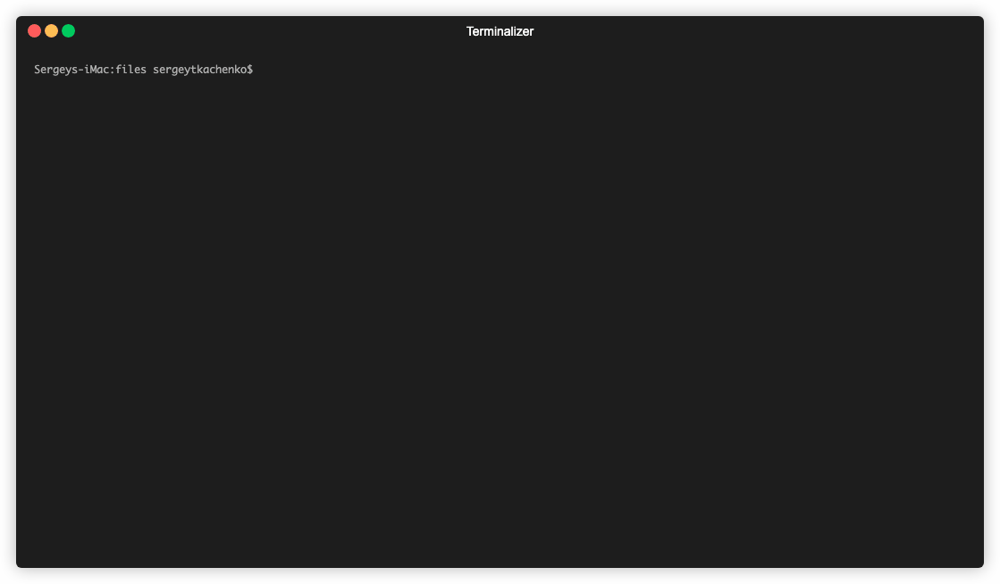

# globalsearch cli



## Description 

This tool help you setup global search in [creatio](https://creatio.com) application.  
It is has GUI for interactive setup step by step.
Besides it has methods for debug setup process.

##  Get started

### Run on client linux server with global search services, greater than or equal to 2.0.0 version

```
docker run -it --rm \
    -v /tmp/gs-out:/app/out \
    -v $(which docker):/usr/bin/docker \
    -v /var/run/docker.sock:/var/run/docker.sock \
    bpmonlinebuild/globalsearch-cli:0.0.1
```

## For developers

### Setup development 

#### npm install

```bash
npm i
# or yarn
```

#### npm run

```bash
npm run build
```

```bash
node build/bundle.js
```

### Docker 

#### build

```bash
docker build -f install/Dockerfile -t globalsearch-cli .
```

##### or build experimental (fastest)

```bash
DOCKER_BUILDKIT=1 docker build -f install/experimental/production/Dockerfile -t globalsearch-cli .
```

#### run from local

```bash
docker run -it --rm \
    -v /tmp/gs-out:/app/out \
    -v $(which docker):/usr/bin/docker \
    -v /var/run/docker.sock:/var/run/docker.sock \
    globalsearch-cli
```

#### run from dockerhub

```bash
docker run -it --rm \
    -v /tmp/gs-out:/app/out \
    -v $(which docker):/usr/bin/docker \
    -v /var/run/docker.sock:/var/run/docker.sock \
    bpmonlinebuild/globalsearch-cli:0.0.1
```

### User workflow docs

* [En](docs/workflow.md)
* [Ru google](https://docs.google.com/spreadsheets/d/1CcB6Pi-lXCl7-zPmwBc-UgXw_1u7_HFS_dMCfr6tlNU/edit#gid=0)

### Changelog

[Changelog](docs/CHANGELOG.md)

### Links

#### Create .gif

[OS X Screencast to animated GIF](https://gist.github.com/dergachev/4627207)
