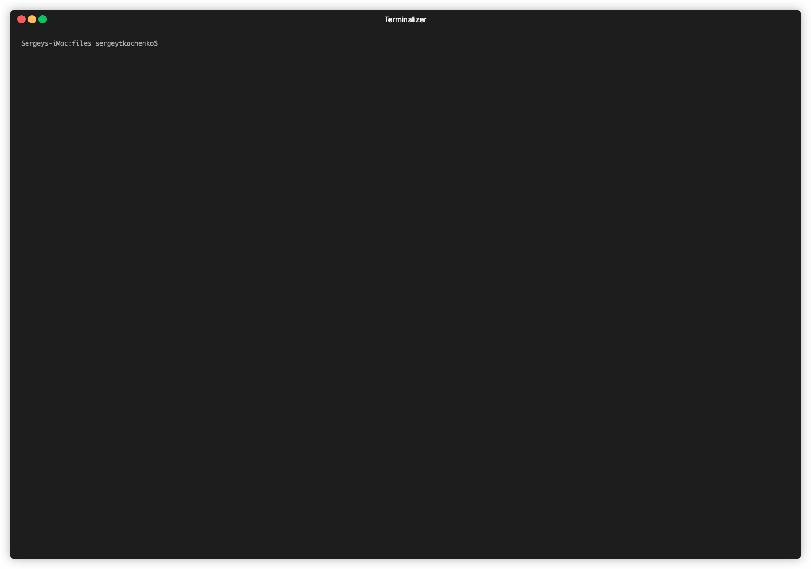

# globalsearch cli



### setup development 

#### npm install

```bash
npm i
# or yarn
```

#### npm run

```bash
npm run start
```

### docker 

#### build

```bash
docker build -f install/Dockerfile -t globalsearch-cli .
```

##### or build experimental (fastest)

```bash
DOCKER_BUILDKIT=1 docker build -f install/experimental/production/Dockerfile -t globalsearch-cli .
```

#### run from local

```bash
docker run -v $PWD:/app/out -it --rm globalsearch-cli
```

#### run from dockerhub

```bash
docker run -v $PWD:/app/out -it --rm bpmonlinebuild/globalsearch-cli
```
