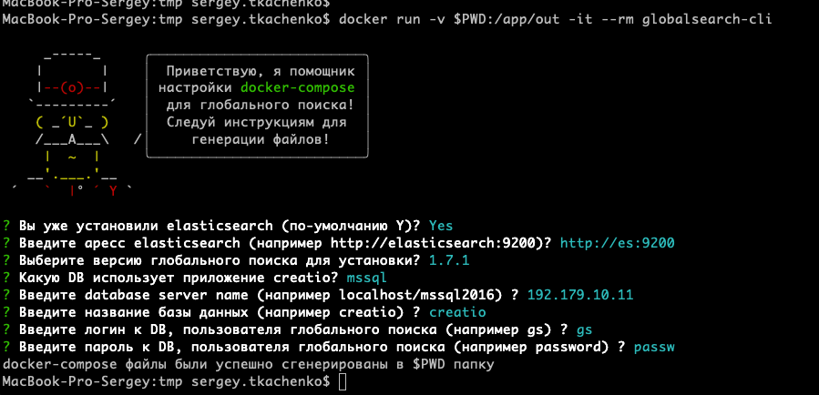

# globalsearch cli



### setup development 

#### npm install

```bash
npm i
# or yarn
```

#### npm run

```bash
npm run start
```

### docker 

#### build

```bash
docker buid -f install/Dockerfile -t globalsearch-cli .
```

#### run

```bash
docker run -it --rm globalsearch-cli
```

